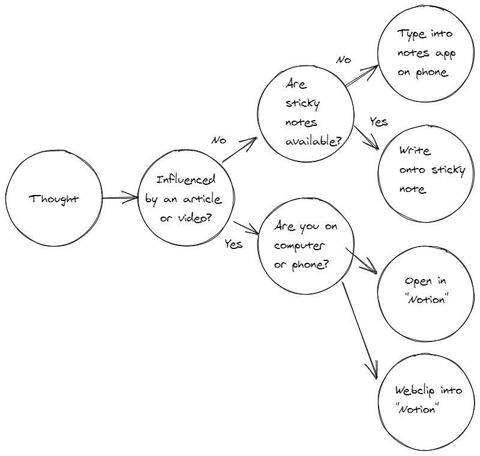
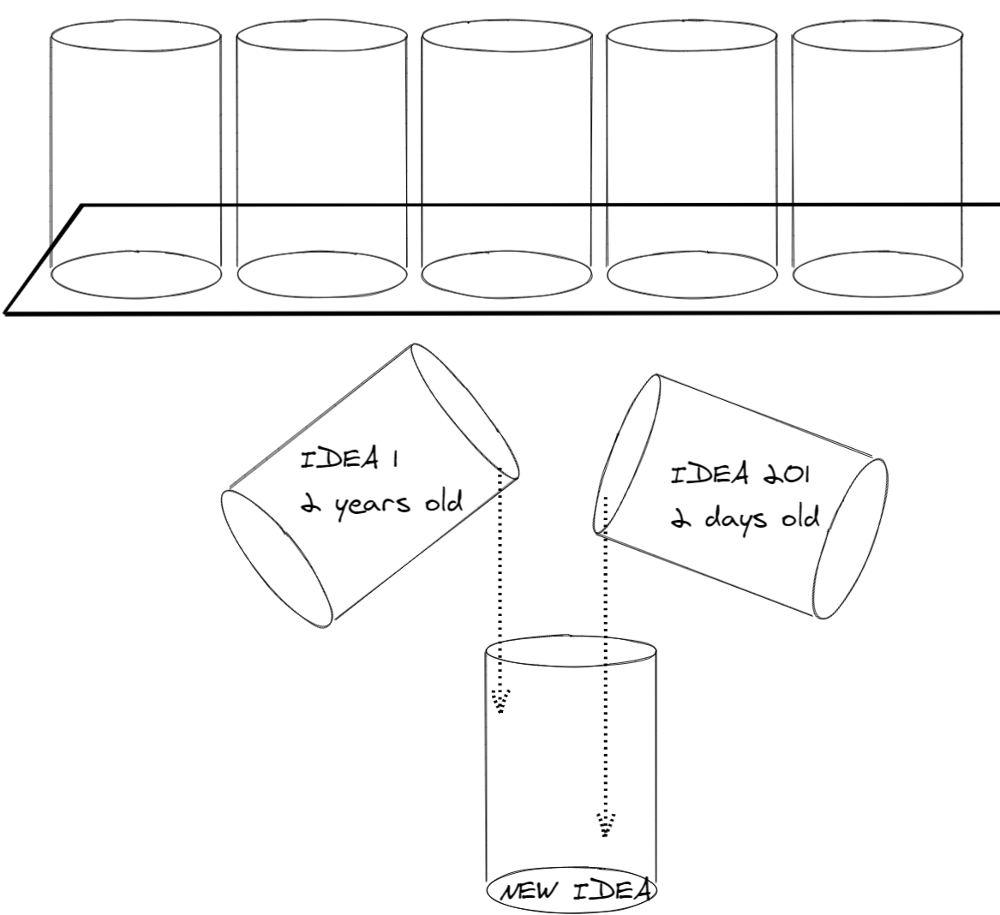

Write, record, or gather any and everything that has your attention into a collection tool. Realize that your brain is for having ideas, not storing them. The theory is to capture the thought immediately because we can't store them for long in our heads. Your system for capturing can be analog, digital or both.

## My capture system

The idea is to get it out of your head so that you don't have to worry about it until you need to worry about it. This is my current system that leverages both analog and digital methods of capturing.

## Never start with a blank page

The goal of capturing is so that you never need to start with a blank page. Instead of wasting energy trying to come up with a new idea, we can just start off at an idea we previously thought of.

I like to think of these ideas as items on a shelf. By having them all laid on in front of you in an easy and accessible form; you can easily find inspiration, motivation and even come up with new better ideas that build off of the previous.
