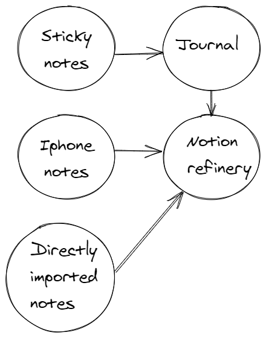

Once you get a hang of capturing ideas, you'll find your shelf will start to get unorganized very fast. It is important to really understand the problem at hand and figure out a lasting solution.

> "If you maintain the same sloppy, pack-rat habits that led to a messy room in the first place, soon you’ll be looking at a new pile of clutter and hoping for another burst of motivation. - Austin Kleon"

## Centralize your ideas

For me my problem was having too many medium's to keep hold of my ideas, I found the solution was to find a centralized system to store all of my ideas. So the idea was for my capturing systems to eventually funnel the ideas into a centralized system, in my case: Notion.

Once the idea is in a centralized place, the idea is to "refine" them. Begin categorizing them appropriately, ask yourself:

- Medium?
- Type?
- Topic?
- Influences?
- Date?
- Links?
- Is it actionable?
- Trash?
- Reference?
- Something to put on hold?
- Status?

## Get creative with your categories

I created my own philosophy when it came to the status of my ideas inside my refinery.

1. No status
2. Consumed
3. Synthesized
4. Implemented

### Consume

The act of consuming an idea. To me this means taking that "phrase" or that "word" of the idea and expanding on it. Consuming it, and then spitting it out into little pieces. This is my brainstorming phase.

### Synthesize

The act of summarizing/reflecting on an idea. To me this means trying to reflect on this and what it means to me. I will build on previous points, emphasize the good points and try to relate the idea to other ideas. This is my analysis phase.

### Implement

The act of creating something out of the idea. This is through an article post, video, social media or some other form of "sharing." By doing it this way I find a sense of accountability, that I am putting myself out there and opening myself up to criticism. It puts me in a position of defense, where I am forced to really think about how I would defend my points if put into question. I think it's through these moments that I will really grow as an individual because these are my "core beliefs" being put to the test - am I able to defend them?
