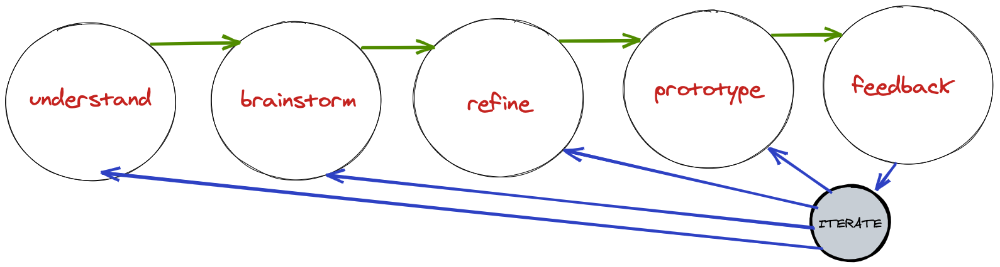

We've talked about systems, and how a way of viewing life is through systems that are made up of processes. Now how do we go about creating these processes? Design them. So the first process we should make is a "Design Process."

> "In life we're always bumping into new problems, and while we have the desire to solve them, it's often hard to find the right solution or even know where to start." - InVision

## Design process

A typical design process, one used in the tech industry for planning solutions for a given problem is broken down into six stages:

1. Understand
2. Brainstorm
3. Refine
4. Prototype
5. Feedback
6. Iterate

The idea is more of a philosophy then a set guideline to follow. Depending on your current state, you are able to skip steps and go backwards or forwards. The key is to realize that it is an iterative process, and to focus on finding a better solution after each iteration.

### Step 1: Understand

Understand is to...

- Figure out the problem
- Research the source
- Explore different perspectives
- Put yourself is someone else's shoes

The goal of the understanding phase is to define the problem as if you were the one who had the problem. Luckily if it is yourself that has the problem that needs solving, it'll be very easy to define it.

### Step 2: Brainstorm

Brainstorm is to...

- Ideate
- Compute up with solutions
- Focus on quantity

The goal of the brainstorming phase is to come up with as many ideas as possible. To focus on quantity, because you're not constrained to using them all → the idea is to remove all restrictions on your thinking.

### Step 3: Refine

Refine is to...

- Connect your ideas
- Pick the ideas that make sense
- Focus on the best solutions

The goal of the refining phase is to relate all your ideas together, and come up with a solution to try.

### Step 4: Prototype

Prototype is to...

- Execute
- Get that first draft out
- Test

The goal of the prototyping phase is to test your solution, and get as much feedback on it as possible.

### Step 5: Feedback

Feedback is to...

- Receive criticism
- Find out what didn't work
- Find out what worked

The goal of the feedback phase is to improve your solution based on another perspective.

### Step 6: Iterate

From here you can jump back to any of the other steps, and then continue the process. The beauty of having an iterative design process for problem solving is that it always allows for improvement, and when we're using it for our own problem's of life we are usually not constrained by deadlines. You can think of your solutions to your problems as eternally changing and improving.

## Think philosophy not guidelines

It is important to view your universal design process as a philosophy, one where you are able to move freely within the steps. Where you are able to remove steps, add steps, skip steps, start at different steps. Some processes may only need 2 steps, but the idea is to be conscious of the other available steps at your disposal; it makes it easier to bounce back when things aren't going well.

For example if I had a process I was trying to design and I designed it like:

1. Brainstorm
2. Prototype

And it didn't work... But since we have this underlying philosophy to fall back to; we can add a new step: maybe we need to refine our ideas? or receive feedback? or maybe we just need to restart, iterate.
