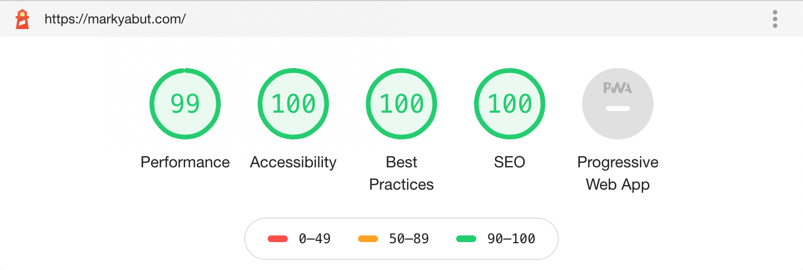
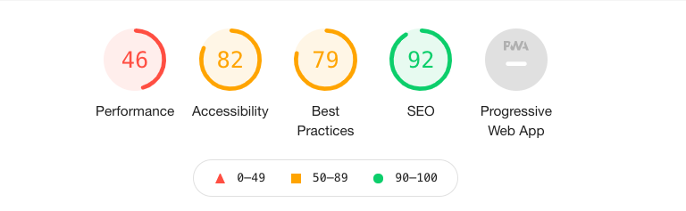
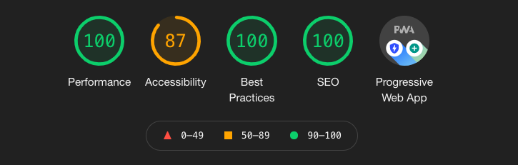

###What is Gatsby?

<a target="_blank" href="https://www.gatsbyjs.com/">Gatsby</a> weaves together the best parts of modern web technologies such as React, webpack, react-router, and GraphQL. If you don’t know what those technologies are, it’s okay! I would say that’s the beauty of Gatsby, you don’t actually need to immediately know all the technologies being used within the application. This is because at the start of development of your application with Gatsby, you are provided with a structure that has all these technologies configured.

###What is the benefit of these technologies compared to sitebuilders such as squarespace?

Use this application as an example, try clicking between pages; it’s super fast! Below is a lighthouse test which is a web developer tool that can give you an idea of how performant a website is.

I rebuilt a client's <a target="_blank" href="https://www.squarespace.com/">Squarespace</a> made website recently. I used Gatsby to rebuild the site and these are the performance metrics before (white-background) and after (black-background).

Good metrics will also lead to better search engine optimization (SEO), allowing your website to rank higher on search engines such as google.

###Use Gatsby to learn the basics

What Gatsby provides is an environment where you start with all the new technologies configured and a structure that allows for the learning of the basics. Instead of ending up with tons of mini side projects resulting from tutorials, you can build all of those pages within a single Gatsby application. By starting with Gatsby, and building out your test cases within the Gatsby ecosystem, you’ll end up with your own personalized documentation, an approach I wish I had taken when first getting into web development. Instead what I ended up with is probably at least 100 different folders of mini projects from tutorials, which I tried to structure within different folders, but just never could come up with a sustainable system for organizing them all.

###How should you start?

I would recommend first learning how to deploy a Gatsby application, and then learn the folder structure. Could easily learn it within a day by watching a crash course on youtube and going through the first bits of the Gatsby documentation. Then depending on whether or not you need to learn the basics of html/css/javascript go and do a few tutorials on those technologies, otherwise you can continue with the docs. Once you get a grasp of the basics, I would highly recommend to start looking into starters and using them as inspirations/templates/guides to start building useful things for yourself. For example I never really dug that deep into CSS, so my styling is pretty bad; so I rely heavily on starters to set up that initial styling aspect of creating an application.

##This site was created with the following technologies:
###Gatsby:

- GraphQL
- React
- Javascript
- HTML
- CSS
- Markdown

###Deployment:

- Github
- Netlify
