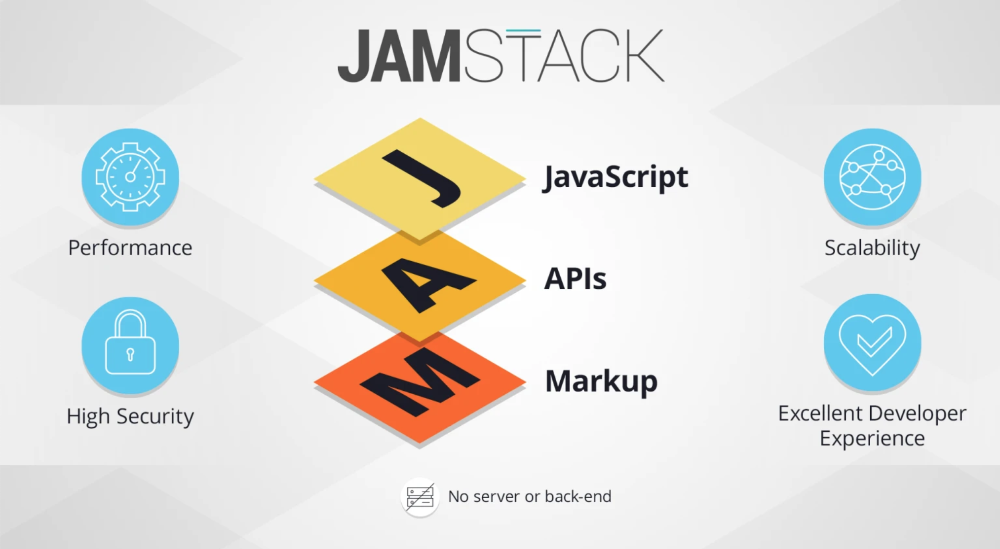

Just got a new macbook, so I figured I'd list out my current technology stack that I am using to build out my web applications.

My current philosophy when developing web applications revolves around the [JAMSTACK](https://jamstack.org/). Below is a quote directly from their website:

> _"Fast and secure sites and apps delivered by pre-rendering files and serving them directly from a CDN, removing the requirement to manage or run web servers."_

It is a design philosophy that revolves around the use of pre-rendered web applications that are hosted as static files. The applications become dynamic by the use of API calls. This is made posible by the growing capabilities of web browsers and services available through APIs.

An example design flow is as follows:

1. Build frontend with gatsbyjs.
2. Connect to a headless content management system (HCMS) to hold my data; depending on the use case this will be either sanity, airtable or contentful.
3. Host code on github and deploy through netlify.
4. Configure a domain through Name Cheap and Netlify.

---

## Programming

- [Javascript](https://en.wikipedia.org/wiki/JavaScript)
- [HTML](https://en.wikipedia.org/wiki/HTML)
- [CSS](https://en.wikipedia.org/wiki/Cascading_Style_Sheets)
- [Markdown](https://en.wikipedia.org/wiki/Markdown)
- [Z shell](<https://en.wikipedia.org/wiki/Z_shell#:~:text=The%20Z%20shell%20(Zsh)%20is,Bash%2C%20ksh%2C%20and%20tcsh.>)

## Frontend Technologies

- [gatsbyjs](https://www.gatsbyjs.com/)
- [reactjs](https://reactjs.org/)

## API Technologies

- [graphql](https://graphql.org/)
- [postman](https://www.postman.com/)

## Microservices

- [netlify](https://www.netlify.com/)
- [github](https://github.com/)
- [snipcart](https://snipcart.com/)
- [airtable](https://airtable.com/)
- [contentful](https://www.contentful.com/)
- [sanity](https://www.sanity.io/)

## Package Manager

- [npmjs](https://www.npmjs.com/)

## Softwares

- [Visual Studio Code](https://code.visualstudio.com/)
- [Google Chrome](https://www.google.com/intl/en_ca/chrome/)

## Domain Names

- [Name Cheap](https://www.namecheap.com/)
